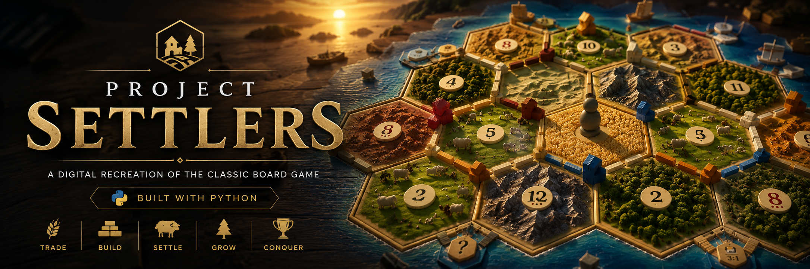

# 🎲 Catan Recreation

### A digital recreation of the classic board game built with Python.

 

> 🚧 **Currently under active development**

---

## 📖 About

This project is a recreation of the classic board game **Catan**, developed in Python.

The goal is to faithfully recreate the game's mechanics while creating a clean, interactive desktop experience.

> **Status:** Early Development

---

## 🛠️ Tech Stack

  

---

## ✨ Planned Features

* 🎲 Random board generation
* 🌾 Resource production
* 🛣️ Road & settlement placement
* 🏙️ City upgrades
* 🤝 Player trading
* 🎴 Development cards
* 🤖 AI opponents
* 🌐 Multiplayer

---

## 📸 Preview

  <i>Screenshots and gameplay GIFs will be added as development progresses.</i>

### ⭐ If you like the project, consider starring the repository!

---

This is an unofficial, non-commercial fan project created for educational purposes.

